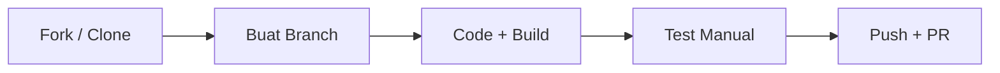

# Contributing to Putry Laundry POS

Thanks for wanting to help! 🙌 Baca panduan ini biar kontribusi lo efektif dan gak bentrok sama yang lain.

---

## 📋 Daftar Isi

- [1. Setup Lokal](#1-setup-lokal)
- [2. Development Workflow](#2-development-workflow)
- [3. Coding Conventions](#3-coding-conventions)
- [4. Commit Message Convention](#4-commit-message-convention)
- [5. Pull Request Process](#5-pull-request-process)
- [6. Issue Reporting](#6-issue-reporting)
- [7. Architecture Notes](#7-architecture-notes)

---

## 1. Setup Lokal

### Prasyarat

- **Node.js** 18+ atau **Bun** (recommended — lebih cepat)
- **Git**
- **SQLite** (built-in, gak perlu install apa-apa — langsung pake `.env.example`)

### Langkah

```bash
# Clone repo
git clone https://github.com/Goetia-lab/putry-laundry-pos.git
cd putry-laundry-pos

# Copy env
cp .env.example .env

# Install dependencies
bun install   # atau npm install

# Generate Prisma Client + push schema SQLite + seed data
npx prisma generate
npx prisma db push
npx tsx prisma/seed.ts

# Jalankan dev server
bun run dev    # → http://localhost:3000
```

> **Catatan:** Untuk production, pakai Supabase PostgreSQL. Ganti `prisma/schema.prisma` dengan yang postgres (`prisma/schema.postgres.prisma`) dan set `DATABASE_URL` + `DIRECT_URL` di env.

---

## 2. Development Workflow



1. **Buat branch dari `main`**: `git checkout -b fix/deskripsi-singkat`
2. **Kerjakan perubahan** — KISS, minimal diff
3. **Pastikan build lulus**: `npx next build`
4. **Push + buka Pull Request** ke `main`

---

## 3. Coding Conventions

### Prinsip

- **KISS** — selesaikan masalah dengan kode sesederhana mungkin
- **DRY** — jangan duplikasi logic yang udah ada
- **No drive-by refactor** — ubah cuma yang diperlukan task ini aja

### Naming

| Entitas | Convention | Contoh |
|---------|-----------|--------|
| File/folder | `kebab-case` | `tutup-buku-view.tsx` |
| Komponen React | `PascalCase` | `BranchClosingCard` |
| Fungsi/var | `camelCase` | `formatRupiah()` |
| API route | `kebab-case` | `/api/daily-closing/` |
| Type/Interface | `PascalCase` | `OperationalExpense` |
| Enum constants | `UPPER_SNAKE` | `EXPENSE_CATEGORIES` |

### TypeScript

- **No `any`** tanpa alasan jelas — kalaupun terpaksa, kasih komentar kenapa
- Prefer `Record<string, unknown>` over `any` buat dynamic objects
- Semua API response harus punya tipe response (cek `src/lib/api.ts`)

### Imports

Urutan:
```
1. React / Next.js (framework)
2. Library eksternal (lucide-react, recharts, dll)
3. @/lib/* (utilities, stores, API hooks)
4. @/components/* (UI components)
5. @/app/* (API routes — gak boleh diimport dari component)
```

### Styling

- Tailwind utility classes — no CSS modules / styled-components
- Dark theme first (`dark:` variants)
- Mobile-first responsive design

---

## 4. Commit Message Convention

```
type: deskripsi singkat (mulai huruf kecil, tanpa titik di akhir)
```

| Type | Kapan |
|------|-------|
| `feat` | Fitur baru |
| `fix` | Bug fix |
| `perf` | Optimasi performa |
| `refactor` | Refactor tanpa perubahan fungsi |
| `docs` | Dokumentasi |
| `chore` | Tooling, config, dependency |
| `style` | Formatting, whitespace |

### Contoh

```
feat: tambah filter tanggal di laporan
fix: pool exhaustion di dashboard — pgbouncer=true
perf: batch query dashboard jadi 4 call instead of 12
docs: tambah panduan kontribusi
```

---

## 5. Pull Request Process

1. **Pastikan build lulus**: `npx next build` — no TypeScript errors
2. **Isi PR template** — deskripsi jelas, screenshot kalo UI
3. **Link issue** yang di-fix (kalo ada)
4. **Review**: minimal 1 approve dari maintainer
5. **Merge**: maintainer yang merge (squash commit)

### PR Title Convention

Sama kayak commit message: `fix: deskripsi`

---

## 6. Issue Reporting

Lihat template yang udah disediain:

- **Bug report** → `.github/ISSUE_TEMPLATE/bug_report.yaml`
- **Feature request** → `.github/ISSUE_TEMPLATE/feature_request.yaml`

Yang penting dicantumin:

- ✅ Langkah reproduksi yang jelas
- ✅ Expected vs actual behavior
- ✅ Screenshot / log (kalo ada)
- ✅ Device & browser

---

## 7. Architecture Notes

### Single-Page App (SPA)

Semua view dirender di `src/app/page.tsx` — navigasi via Zustand store (`useNavStore`). Gak pake routing Next.js untuk halaman internal.

### Data Flow

```
API Route (/api/*) → Prisma → PostgreSQL/SQLite
        ↓
TanStack Query (useQuery/useMutation)
        ↓
React Component
```

### Pool Connection Fix

Production di Vercel + Supabase pake **PgBouncer transaction pool** (port 6543). Kode di `src/lib/db.ts` otomatis inject `pgbouncer=true&connection_limit=1`. **Jangan hapus** atau ubah bagian ini tanpa testing concurrent load.

### Key Files

| File | Fungsi |
|------|--------|
| `src/lib/db.ts` | PrismaClient singleton + pool params |
| `src/lib/api.ts` | Semua TanStack Query hooks |
| `src/lib/stores.ts` | Zustand (cart, nav, branch selection) |
| `src/lib/format.ts` | Rupiah, date, loyalty tier helpers |
| `src/components/layout/app-shell.tsx` | Layout utama + bottom nav |
| `src/components/views/*` | 9 halaman aplikasi |
| `src/app/api/*` | Semua REST endpoints |

---

**Ada pertanyaan?** Buka issue dengan label `question` atau chat langsung.
